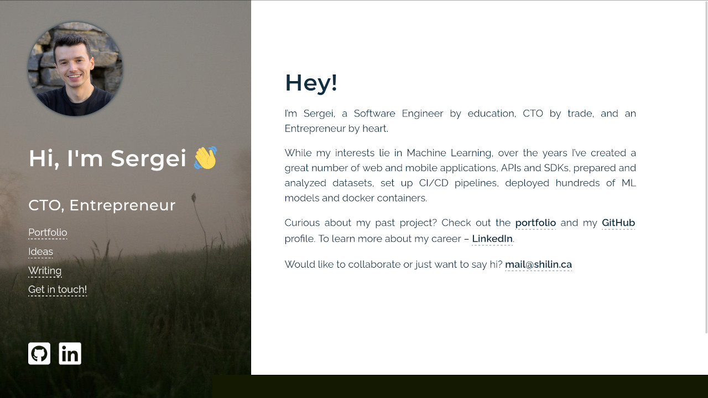

# shilin.ca

Personal portfolio website of Sergei Shilin. The base is [Hugo](https://github.com/gohugoio/hugo) framework, and the theme is [personal-web](https://github.com/bjacquemet/personal-web).



## Server
```bash
hugo server
```
