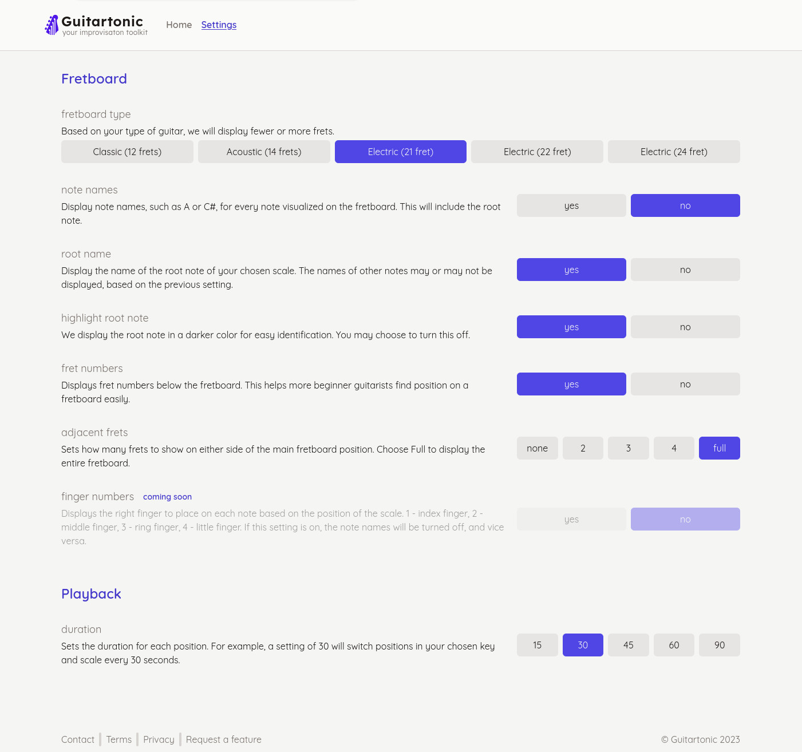

Guitartonic is a guitar improvisation tool that helps practice different scales in multiple positions and learn to play over the whole fretboard. [I wrote about how Guitartonic was born.](/writing/guitartonic)

Over time, it has evolved from a simple randomizer tool to a full-blown website with ability for users to change their settings.

We also collaborated with the biggest backing track creator <a href="https://tombaileymusic.com/" target="_blank">Tom Bailey</a>, so the majority of the tracks on the website are kindly provided by him.

### Tech

Tech is a <a href="https://kit.svelte.dev/" target="_blank">SvelteKit</a> website written in Typescript. It uses sessions to save user's settings. There's no server component and no database.
